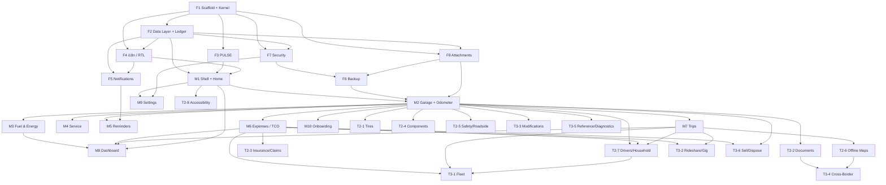

# 🗺️ Delivery Roadmap

**Car and Pain** — _Less pain. More car. 100% offline._

This roadmap sequences the build into four strictly-gated milestones. Each milestone completes before the next begins, and every feature epic carries its own vertical slice — data model, PULSE UI, i18n, tests, and export/backup mapping — down to the row level. The guiding constraints are the offline-first / account-free promise, the built-in-first / minimal-dependency policy, and the PULSE redundant-encoding contract (status is _always_ encoded beyond colour: icon + label + shape + position).

---

## Milestones at a glance

| Tier | Milestone | Epics | Goal |
| --- | --- | --- | --- |
| 1 | **Foundation** | F1–F8 | Ship the offline-first foundation every feature stands on. |
| 2 | **MVP** | M1–M10 | A daily-usable, buy-once app across the core ownership modules. |
| 3 | **Tier 2** | T2-1–T2-8 | Round out the ownership stack rivals leave open. |
| 4 | **Tier 3** | T3-1–T3-6 | Serve specialist and end-of-life needs. |

---

## 🧱 Foundation — the offline-first bedrock

> Ship the offline-first foundation every feature stands on: scaffold + kernel, the encrypted canonical data layer with the shared odometer ledger, the PULSE design system, the i18n/RTL/calendars/numerals engine, the local notification engine, backup/export/import + key recovery, security & app-lock, and the attachments/media pipeline.

- **F1 — Project scaffold, tooling & app kernel** — feature-first modular monolith on a Dart pub workspace (Melos), lints, CI/CD, flavors, the Riverpod DI/provider graph, the sealed `Result`/`Failure` error kernel, and async-initialized app bootstrap.
- **F2 — Encrypted data layer, canonical model & odometer ledger** — Drift-over-encrypted-SQLite (SQLCipher), canonical SI units and ISO-4217 minor-unit money, the shared odometer/engine-hour ledger, forward-only migrations, soft-delete/trash, the custom taxonomy, and data-integrity validation.
- **F3 — PULSE design system implementation** — warm-paper/ink dual-theme tokens, Persian-miniature palette, the urgency/emotional-temperature scale with always-redundant non-colour encoding, the single breathing vital + capped ambient halo, the exhale interaction, Rooms scaffolding, and CustomPainter charts (no chart lib).
- **F4 — i18n / RTL / calendars / numerals engine** — gen-l10n ARB pipeline for LTR(en/de/fr) + RTL(fa/ar/ckb), app-controlled locale in the encrypted DB, own Gregorian/Jalali/Hijri/Hebrew conversion math, numeral shaping with Indian grouping, bidi-isolation of IDs/units, and bundled script fonts.
- **F5 — Local notification engine** — one offline scheduler on `flutter_local_notifications` `zonedSchedule` (+timezone) with the DB as source of truth: date, distance-projection, engine-hour and whichever-first triggers, grouped digests, per-severity channels, and reboot/Doze/exact-alarm survival.
- **F6 — Backup, export/import & key recovery** — WAL-checkpointed `VACUUM INTO` single-file AES-GCM backups (Argon2id-derived key) that round-trip attachments, per-entity CSV + `dart:convert` JSON export, a merge-aware import wizard with competitor presets, schema/format versioning + checksums, and passphrase-wrapped master-key recovery with a one-time recovery code.
- **F7 — Security, encryption & app-lock** — mandatory whole-DB AES-256 at rest, a random 256-bit master key recoverable by default via an Argon2id passphrase KEK, hardware-keystore-backed biometric/PIN daily unlock with PIN fallback, sensitive-section scoping, and redaction in handover exports.
- **F8 — Attachments & media pipeline** — photos/receipts/scans/PDFs/dashcam clips attach polymorphically to any record, compressed with thumbnails/transcode, stored app-private (optionally encrypted), size-accounted, orphan-cleaned, and bundled + re-linked through backup/restore.

---

## 🚗 MVP — the daily-usable, buy-once app

> A daily-usable, buy-once app: the PULSE breathing-vital Home + Cockpit/Garage/Pit-lane Rooms shell over the multi-vehicle garage, fuel/energy, service, reminders, expenses/TCO, trips, dashboard/reports, settings, and first-run onboarding.

- **M1 — App shell, Rooms navigation & PULSE vitals Home** — a `go_router` `StatefulShellRoute.indexedStack` Rooms shell (Cockpit/Garage/Pit-lane) with per-tab master-detail stacks, full-screen flows above it, the persistent active-vehicle selector, and the single breathing-vital Home.
- **M2 — Vehicles, Garage & Odometer** — the account-free unlimited multi-vehicle garage: powertrain-adaptive profiles, full lifecycle states, VIN capture with offline decode, per-vehicle unit/currency overrides, audited cluster-swap/rollover events, and the odometer/engine-hour ledger UI. _The hub every module scopes to._
- **M3 — Fuel & Energy** — petrol/diesel/LPG/CNG/ethanol/hydrogen fills and EV/PHEV charge sessions with correct full/partial/missed/first-fill economy math, EV break-even vs ICE, canonical-unit storage, and PULSE entry + economy visualizations.
- **M4 — Service & Maintenance** — multi-line-item visits mapped to one receipt, fully custom service types, parts with part numbers and warranties, DIY procedure logs, bundled offline schedule templates, and appointment/next-due reminders.
- **M5 — Reminders & Notifications** — the user-facing layer on the foundation notification engine: date/distance/engine-hour/whichever-first rules, odometer-freshness projection into schedulable dates, grouped digests, per-severity channels, and PULSE reminder surfaces with the exhale on completion.
- **M6 — Expenses & Cost of Ownership** — rich + custom categories, recurring and amortized bills, budgets with real alerts, full loan/lease amortization (early-payoff/refinance/negative-equity), depreciation, and a true on-device TCO engine.
- **M7 — Trips & Mileage Logbook** — manual and optional on-device-GPS trip logging: business/personal tax classification, effective-dated IRS/HMRC/custom rate engines, odometer-gap reconciliation, and a road-trip mode linking fuel and expenses.
- **M8 — Dashboard, Statistics & Reports** — glanceable customizable KPIs + quick-add, fuel-economy/cost/distance/CO₂ CustomPainter charts, insights and anomaly detection, forecasting with a min-samples fallback, gamification, and a complete localized report export.
- **M9 — Settings & Preferences** — language, units, currency, calendar and numerals, accessibility, notification behavior, security and app-lock, and backup scheduling (incl. self-hosted) — all resolving through the canonical precedence model.
- **M10 — Onboarding, Help & Education** — guided permission/OEM-survival onboarding, a demo/sample vehicle, a guided tour, contextual education for complex features (TCO, full-to-full economy, calendars), and searchable in-app help/FAQ — all offline.

---

## 🧰 Tier 2 — rounding out the ownership stack

> Round out the ownership stack rivals leave open: tires/seasonal, documents/compliance glovebox, insurance/claims/warranty, components/consumables, safety/incidents/roadside, the shared offline map layer, drivers/household, and hardened cross-cutting accessibility.

- **T2-1 — Tires, Wheels & Seasonal** — multiple named sets, seasonal changeover with automatic per-set mileage accrual, rotation, per-position multi-point tread and pressure, TPMS, and DOT-age safety alerts.
- **T2-2 — Documents, Glovebox & Compliance** — the encrypted digital glovebox plus registration, road tax, localized technical inspection, emissions, driver license, and recurring legal/safety items — unified with reminders and sensitive-section scoping.
- **T2-3 — Insurance, Claims & Warranty Compliance** — multi-policy insurance with premium history and no-claims bonus, a full claims lifecycle (FNOL → adjuster → authorisation → payout vs deductible), and a warranty-compliance dashboard.
- **T2-4 — Components, Batteries, Keys & Consumables** — the 12V starter battery, keys/fobs, wear items with lifecycle, fluids and spare-parts inventory — each with its own reminders and warranty.
- **T2-5 — Safety, Incidents & Roadside** — accident/damage records with photos and dashcam clips, an at-scene guided capture wizard, a shareable roadside emergency card and ICE info — usable with zero signal and sensitive-section scoped.
- **T2-6 — Offline Maps & Location** — a shared bundled/vector offline map layer rendering pins and route polylines for trips, parking saver, find-my-car, stations and incidents — with region caching and compass/distance fallback.
- **T2-7 — Drivers, Household & Sharing** — per-driver profiles, assignment, and P&L — plus the schema groundwork for later household peer-to-peer sync (UUID + tombstone + `updated_at`).
- **T2-8 — Accessibility & Inclusive Design** — screen-reader support (incl. RTL reading order), dynamic type/font-scaling reflow, high-contrast and colour-blind-safe palettes, reduced-motion, and minimum touch targets — audited across shipped screens.

---

## 🏁 Tier 3 — specialist & end-of-life needs

> Serve specialist and end-of-life needs: fleet/business/company-car, rideshare/gig/rental economics, the modifications build log, cross-border travel & emission zones, offline reference/diagnostics/recalls, and the guided sell/dispose transfer.

- **T3-1 — Fleet, Business & Company-Car** — Benefit-in-Kind tax, cost-centre/department/project allocation, grey-fleet, fuel-card reconciliation, VAT-reclaim workflow, and mileage claims.
- **T3-2 — Rideshare, Gig & Rental Economics** — per-platform income vs cost, business-use percentage from mixed trips, per-job/per-shift profitability, platform-fee tracking, and rental (Turo/peer-to-peer) hosting economics.
- **T3-3 — Modifications & Build Log** — aftermarket/OEM+ parts with install date/odometer, before/after specs, dyno/power figures, reversibility notes, and build media galleries.
- **T3-4 — Cross-Border, Travel & Emission Zones** — emission-zone stickers, vignettes and e-toll transponder accounts, per-country required-equipment and driving-rules reference, IDP/green-card documents, and temporary import/export.
- **T3-5 — Reference, Diagnostics & Recalls** — bundled generic maintenance-schedule templates, warning-light and DTC dictionaries as guaranteed offline content, a check-engine event log, and offline VIN decode — with honest online-degradation.
- **T3-6 — Sell, Dispose & Ownership Transfer** — de-registration and insurance/tax cancellation checklists, bill-of-sale and odometer-disclosure generation, a redacted handover pack, and final TCO close-out.

---

## 🧭 Recommended build sequence

### Why Foundation → MVP → Tier 2 → Tier 3

Strict tier gating keeps risk front-loaded and rework near zero. The Foundation tier delivers the cross-cutting subsystems — encrypted data, the odometer ledger, PULSE, i18n, notifications, backup, security, attachments — that _every_ feature epic wires into. Building any feature before those exist would mean re-plumbing its data, encryption, localization, and backup mapping later. Once the foundation is complete, the **MVP** assembles the core ownership loop (garage → fuel/service/expenses/trips → reminders → dashboard) into a shippable buy-once app. **Tier 2** then extends that stack into the gaps rivals leave open, and **Tier 3** serves specialist and end-of-life segments last, since each of those depends on MVP modules already being in place (maps → trips, fleet → expenses/trips/drivers, sell-dispose → expenses/backup, cross-border → documents/maps).

### Intra-Foundation order

1. **F1 (scaffold + kernel)** is the root of every dependency — the workspace, DI graph, error kernel, and bootstrap.
2. **F2 (encrypted data layer + odometer ledger)** must exist before any feature touches data; it enforces the canonical unit/money contract at every repository boundary.
3. **F3 (PULSE)** and **F4 (i18n)** can run in parallel with each other once F1 lands (F4 also needs F2 for locale persistence). F3 precedes all UI; F4 precedes any user-facing text.
4. **F7 (security)** and **F8 (attachments)** build on F1/F2 and are prerequisites for backup.
5. **F5 (notification engine)** builds on F1/F2/F4 and precedes Reminders (M5) and every reminder-driven module.
6. **F6 (backup)** lands last in the tier: it depends on F7 + F8 and must exist before feature epics wire their entities into it — backup covers **every** entity.

### Within MVP

- **M1 (shell + Home)** unblocks all feature UI.
- **M2 (garage + ledger UI)** is the hub that M3–M7 scope to.
- **M8 (dashboard)** depends on the data-producing modules M3/M6/M7.
- **M9/M10** depend on the cross-cutting foundation surfaces (settings on F5/F7; onboarding on F5 + M2).

### Tier 2 / Tier 3

Each epic depends on its foundation slices plus the MVP modules it extends. Every feature epic carries its own vertical slice down to export/backup mapping and tests, honoring the built-in-first / minimal-dependency policy and the PULSE redundant-encoding contract.

---

## 🔗 Key epic dependencies

---

## 📋 Epic reference tables

### Foundation

| Epic | Title | Depends on |
| --- | --- | --- |
| F1 | [Project scaffold, tooling & app kernel](./epics/F1-project-scaffold-tooling-app-kernel.md) | — |
| F2 | [Encrypted data layer, canonical model & odometer ledger](./epics/F2-encrypted-data-layer-canonical-model-odomete.md) | F1 |
| F3 | [PULSE design system implementation](./epics/F3-pulse-design-system-implementation.md) | F1 |
| F4 | [i18n / RTL / calendars / numerals engine](./epics/F4-i18n-rtl-calendars-numerals-engine.md) | F1, F2 |
| F5 | [Local notification engine](./epics/F5-local-notification-engine.md) | F1, F2, F4 |
| F6 | [Backup, export/import & key recovery](./epics/F6-backup-export-import-key-recovery.md) | F1, F2, F7, F8 |
| F7 | [Security, encryption & app-lock](./epics/F7-security-encryption-app-lock.md) | F1, F2 |
| F8 | [Attachments & media pipeline](./epics/F8-attachments-media-pipeline.md) | F1, F2 |

### MVP

| Epic | Title | Depends on |
| --- | --- | --- |
| M1 | [App shell, Rooms navigation & PULSE vitals Home](./epics/M1-app-shell-rooms-navigation-pulse-vitals-home.md) | F1, F2, F3, F4 |
| M2 | [Vehicles, Garage & Odometer](./epics/M2-vehicles-garage-odometer.md) | F2, F3, F4, F6, F8, M1 |
| M3 | [Fuel & Energy](./epics/M3-fuel-energy.md) | F2, F3, F4, F6, M2 |
| M4 | [Service & Maintenance](./epics/M4-service-maintenance.md) | F2, F3, F4, F6, F8, M2 |
| M5 | [Reminders & Notifications](./epics/M5-reminders-notifications.md) | F2, F3, F4, F5, F6, M2 |
| M6 | [Expenses & Cost of Ownership](./epics/M6-expenses-cost-of-ownership.md) | F2, F3, F4, F6, F8, M2 |
| M7 | [Trips & Mileage Logbook](./epics/M7-trips-mileage-logbook.md) | F2, F3, F4, F6, M2 |
| M8 | [Dashboard, Statistics & Reports](./epics/M8-dashboard-statistics-reports.md) | F2, F3, F4, F6, M1, M3, M6, M7 |
| M9 | [Settings & Preferences](./epics/M9-settings-preferences.md) | F2, F3, F4, F5, F6, F7, M1 |
| M10 | [Onboarding, Help & Education](./epics/M10-onboarding-help-education.md) | F2, F3, F4, F5, M1, M2 |

### Tier 2

_Full detail lives in the [Tier 2 backlog](./tier-2-backlog.md)._

| Epic | Title | Depends on |
| --- | --- | --- |
| T2-1 | [Tires, Wheels & Seasonal](./tier-2-backlog.md) | F2, F3, F4, F5, F6, F8, M2 |
| T2-2 | [Documents, Glovebox & Compliance](./tier-2-backlog.md) | F2, F3, F4, F5, F6, F7, F8, M2 |
| T2-3 | [Insurance, Claims & Warranty Compliance](./tier-2-backlog.md) | F2, F3, F4, F5, F6, F8, M2, M6 |
| T2-4 | [Components, Batteries, Keys & Consumables](./tier-2-backlog.md) | F2, F3, F4, F5, F6, F8, M2 |
| T2-5 | [Safety, Incidents & Roadside](./tier-2-backlog.md) | F2, F3, F4, F6, F7, F8, M2 |
| T2-6 | [Offline Maps & Location](./tier-2-backlog.md) | F2, F3, F4, F6, M7 |
| T2-7 | [Drivers, Household & Sharing](./tier-2-backlog.md) | F2, F3, F4, F6, M2, M6, M7 |
| T2-8 | [Accessibility & Inclusive Design](./tier-2-backlog.md) | F3, F4, M1 |

### Tier 3

_Full detail lives in the [Tier 3 backlog](./tier-3-backlog.md)._

| Epic | Title | Depends on |
| --- | --- | --- |
| T3-1 | [Fleet, Business & Company-Car](./tier-3-backlog.md) | F2, F3, F4, F6, M6, M7, T2-7 |
| T3-2 | [Rideshare, Gig & Rental Economics](./tier-3-backlog.md) | F2, F3, F4, F6, M6, M7 |
| T3-3 | [Modifications & Build Log](./tier-3-backlog.md) | F2, F3, F4, F6, F8, M2 |
| T3-4 | [Cross-Border, Travel & Emission Zones](./tier-3-backlog.md) | F2, F3, F4, F5, F6, T2-2, T2-6 |
| T3-5 | [Reference, Diagnostics & Recalls](./tier-3-backlog.md) | F2, F3, F4, F6, M2 |
| T3-6 | [Sell, Dispose & Ownership Transfer](./tier-3-backlog.md) | F2, F3, F4, F6, M2, M6 |
