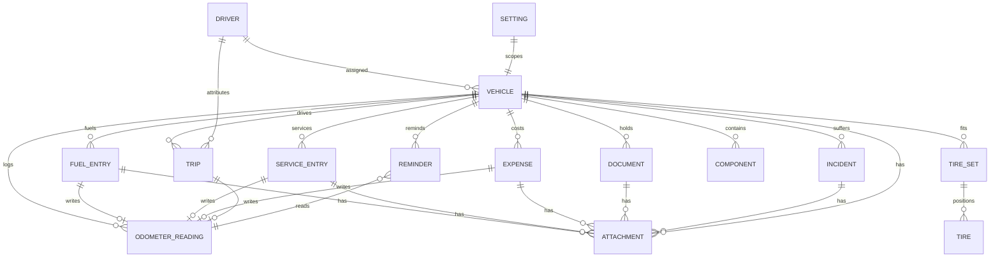

# 🗃️ Canonical Data Model & Schema

The single source of truth for how **Car and Pain** stores everything on-device: one unified, offline-first entity model where every module writes to a shared, auditable backbone so that switching units, currency, calendar, or language never corrupts a single row of history.

> This document is the canonical reference. Individual field lists live in each feature doc; this file defines the shared conventions, the entity graph, the hub tables, and how it all round-trips through export/import. See the [Car and Pain — Product Overview & Architecture](../overview.md) for the wider picture and the [Glossary, Units, Calendars & Conventions](./glossary.md) for term definitions.

---

## Conventions

The data model exists to keep the app's core promise: **your data lives on your device, and it stays correct forever.** These conventions are what make that true.

- **UUID primary keys.** Every entity is identified by a device-generated UUID, never an auto-increment integer. This lets two phones create records independently (household peer-to-peer sync) without key collisions, and lets records survive export, re-import, and device migration with stable identity.
- **Canonical storage, display-time conversion.** Values are stored once, in one canonical form, and converted only when shown or exported:
  - **Distance, volume, pressure, temperature, energy** → stored in SI base units (metres/litres/kilopascals/kelvin-or-Celsius/kWh); MPG, US/UK gallons, psi, and °F are display projections.
  - **Timestamps** → stored as UTC ISO-8601 (`stored_utc_timestamp`), with a **separate display calendar** preference (Gregorian / Jalali / Hijri / Hebrew). The stored instant never changes when the user switches calendar or numeral system.
  - **Money** → stored in a base/home currency with the **stored FX rate** (`exchange_rate`) and its `rate_date` captured on the record, so a historical expense keeps its true converted value even years later. Offline multi-currency uses manual/dated rate snapshots — never live FX.
- **Soft-delete tombstones.** Deletes are non-destructive: a row is flagged `is_deleted` with `deleted_at` and moves to a user-facing trash (`trash_expires_at`) rather than being erased. Tombstones are what make merge/restore and peer-to-peer sync safe — a delete on one device propagates instead of being silently resurrected by the other.
- **Schema versioning + forward migrations.** Every database carries a `schema_version`; upgrades run ordered, forward-only migration scripts guarded by a pre-migration snapshot. Backups additionally carry `backup_format_version` and `min_supported_version` so an older build refuses (rather than corrupts) a newer archive.
- **Universal audit columns.** Every entity carries `created_at` and `updated_at` (plus `device_origin_id` / `row_revision` where sync-relevant). `updated_at` is the tiebreaker for last-write-wins merge; `created_at` preserves true entry order independent of any backdated `date` field the user typed.

Precedence for any convertible preference resolves **per-record override → per-vehicle setting → global default**, so a diesel van logged in litres can sit in the same garage as a US-gallon pickup without either being rewritten.

---

## Entity relationship overview

Car and Pain uses a **hub-and-spoke** model. `VEHICLE` is the hub; every operational record references it. The shared `ODOMETER_READING` ledger is written by many modules and read by even more. `ATTACHMENT` attaches polymorphically to any record. `DRIVER` and `SETTING` provide the cross-cutting who/how.

The polymorphic `ATTACHMENT` edge is deliberately drawn to several parents: photos, receipts, PDFs, and dashcam clips can hang off virtually any record, and each attachment stores which entity it is `linked_entity` to so the backup can re-link it on restore.

---

## Core entities

Field tables below are drawn from each hub module's canonical `data_fields`. Types are framework-agnostic (any store — SQLite, Realm, files — can honour them).

### Vehicle

The hub. A rich, powertrain-adaptive profile plus lifecycle state. See [Vehicles, Garage & Odometer](../features/01-vehicles-garage.md).

| Field | Type | Notes |
|---|---|---|
| `vehicle_id` | uuid | Primary key. |
| `nickname` | string | User-facing label used across the app and in notifications. |
| `make` / `model` / `model_year` / `trim` / `generation` | string / int | Identity and spec resolution. |
| `vehicle_type` | enum | Car, motorcycle, van, truck, etc.; drives adaptive fields and metrics. |
| `wheel_count` / `axle_config` | int / string | Feeds tire positions and axle-aware workflows. |
| `license_plate` / `plate_country` / `plate_history[]` | string / list | Current plate plus prior-plate history; rendered LTR even in RTL layouts. |
| `vin` / `vin_scanned` / `vin_checksum_valid` / `wmi_decoded` | string / bool / bool / obj | VIN, whether captured by scan, ISO 3779 check-digit result, decoded World Manufacturer Identifier. |
| `color_name` / `paint_code` | string | Cosmetic identity. |
| `engine_code` / `displacement_cc` / `power_hp_kw` | string / int / obj | Engine spec. |
| `transmission_type` / `drivetrain` | enum | Gearbox and drive layout. |
| `energy_type` / `secondary_energy_type` | enum | Primary and (PHEV/bi-fuel) secondary energy source. |
| `tank_capacity` | number (SI L) | Nominal tank volume; feeds range and over-capacity validation. |
| `battery_capacity_kwh` / `usable_capacity_kwh` | number | EV pack nominal and usable capacity; feeds SoC→kWh estimates. |
| `connector_types[]` | list | Supported charge connectors. |
| `state_of_health_log[]` | list | Dated EV battery State-of-Health entries. |
| `engine_hour_meter` | number | For hour-metered vehicles; parallels the odometer ledger. |
| `distance_unit` / `volume_unit` / `consumption_unit` / `currency` | enum | Per-vehicle display overrides above the global default. |
| `purchase_date` / `purchase_price` / `odometer_at_purchase` / `condition` | date / money / number / enum | Acquisition baseline for TCO and depreciation. |
| `current_value` / `valuation_history[]` | money / list | Latest and historical valuations for equity and depreciation. |
| `status` / `status_changed_at` | enum / ts | Lifecycle: active / archived / sold / scrapped / stolen / written-off. |
| `sold_date` / `sold_price` / `final_odometer` | date / money / number | Disposal close-out inputs. |
| `current_odometer` / `current_odometer_date` | number / date | Cached latest reading for fast display. |
| `reading_timeline[]` | list | The per-vehicle odometer/engine-hour ledger (see OdometerReading). |
| `offset_after_cluster_swap` | number | Cumulative offset applied after a cluster replacement/rollover. |
| `factory_reference_specs{}` / `owners_manual_ref` | obj / ref | Bundled reference specs and manual pointer. |
| `cover_photo_ref` / `photo_gallery[]` | ref / list | Vehicle imagery (attachments). |
| `group_id` / `tags[]` / `assigned_driver_ids[]` | ref / list / list | Grouping, custom tags, driver assignment. |
| `created_at` / `updated_at` / `is_default` | ts / bool | Audit columns and the active-garage default flag. |

### OdometerReading (shared ledger)

The single monotonic per-vehicle reading timeline — the app's spine. It is **written** by fuel, service, expense, trip, tire, and manual entries and **read** by reminders, statistics, tires, warranties, and financing. Materialized as `Vehicle.reading_timeline[]`; each reading records its `source` module, supports cluster-swap offsets and rollover, and validates regressions. This ledger powers `avg_daily_distance` and `estimated_odometer_today`, which drive projection-based reminder scheduling everywhere. See [Vehicles, Garage & Odometer](../features/01-vehicles-garage.md).

| Field | Type | Notes |
|---|---|---|
| `reading_id` | uuid | Primary key of a ledger row. |
| `vehicle_id` | uuid → Vehicle | Owner. |
| `value` | number (SI) | Raw odometer (or engine-hour) reading. |
| `date` | date/ts | Effective reading date; may be backdated. |
| `source` | enum | Which module wrote it (fuel/service/expense/trip/tire/manual). |
| `source_record_id` | uuid | Back-reference to the originating record. |
| `cumulative_offset` | number | Cluster-swap/rollover offset; `lifetime_distance = value + cumulative_offset`. |
| `is_regression_override` | bool | Set when the user knowingly accepts a lower-than-previous reading. |

### FuelEntry

One unified energy record covering liquid/gas fills and EV/PHEV charge sessions, with the full/partial/missed/first-fill economy state machine. See [Fuel & Energy](../features/02-fuel-energy.md).

| Field | Type | Notes |
|---|---|---|
| `entry_id` | uuid | Primary key. |
| `vehicle_id` | uuid → Vehicle | Owner. |
| `date` / `time` | date / time | When fuelled/charged. |
| `odometer` / `trip_meter` | number | Reading at fill (writes the ledger) and optional trip meter. |
| `volume` / `volume_unit` | number / enum | Liquid/gas quantity in canonical volume. |
| `price_per_unit` / `total_cost` / `currency` | money | Any two of price/volume/total drive the third at 3-decimal precision. |
| `fuel_type` / `octane_grade` / `secondary_fuel_type` | enum / string | Energy chemistry and grade; bi-fuel secondary. |
| `is_full_tank` / `is_partial` / `is_missed_previous` | bool | The economy state machine flags. |
| `estimated_fuel_remaining` | number | For partial fills, to bridge economy intervals. |
| `exclude_from_economy` | bool | Keeps outliers/errors out of the averages without deleting them. |
| `tank_number` | int | For dual-tank vehicles. |
| `station_id` / `station_name` / `station_brand` | ref / string | Where it happened. |
| `latitude` / `longitude` | number | Station location (offline map pin). |
| `payment_method` / `fuel_card_id` / `is_free` | enum / ref / bool | Payment and fuel-card reconciliation; free/comped fills. |
| `energy_kwh` / `price_per_kwh` | number / money | EV energy and tariff. |
| `charger_type` / `charge_network` / `charge_membership_id` / `connector_type` | enum / string / ref | Charging context. |
| `start_soc_pct` / `end_soc_pct` | number | State-of-charge for kWh-from-SoC estimation. |
| `is_home_charge` / `tou_rate` | bool / obj | Home vs public; time-of-use rate. |
| `self_generated_kwh` / `energy_from_wall_kwh` | number | Solar/self-generated vs metered wall energy for true-cost math. |
| `receipt_photo_ref` | ref → Attachment | Receipt image. |
| `tags[]` / `trip_id` / `notes` | list / ref / string | Tagging, trip linkage, free text. |

### ServiceEntry

A multi-line-item service visit mapped to one receipt, with parts, fluids, warranties, DIY procedure logs, and interval logic. See [Service & Maintenance](../features/03-service-maintenance.md).

| Field | Type | Notes |
|---|---|---|
| `visit_id` | uuid | Primary key of the visit. |
| `vehicle_id` | uuid → Vehicle | Owner. |
| `date` / `odometer_at_service` | date / number | When done (writes the ledger). |
| `provider_id` / `diy_flag` | ref / bool | Shop vs do-it-yourself. |
| `line_items[]` | list of obj | `{service_type_id, parts[], labour_cost, parts_cost, warranty, resets_interval_flag}` — many jobs, one receipt. |
| `parts_used[]` | list of obj | `{name, brand, oem_number, aftermarket_number, quantity, unit_cost, supplier}`. |
| `fluids[]` | list of obj | `{type, spec, quantity, unit}`. |
| `total_cost` / `labour_hours` / `labour_rate` / `tax` / `discount` / `currency` | money / number | Cost breakdown; visit total = Σ(parts+labour)+tax−discount+fees. |
| `interval_distance` / `interval_time` / `interval_logic` / `schedule_profile` | number / enum | Recurrence definition and normal/severe profile. |
| `warranty_until_date` / `warranty_until_mileage` | date / number | Work/parts warranty limits. |
| `appointment{}` | obj | `{datetime, shop_id, ics_ref, status}` scheduled visit. |
| `quotes[]` | list of obj | `{shop, amount, date, notes}` for best-quote selection. |
| `attachments[]` | list → Attachment | Receipts, invoices, photos. |
| `checklist[]` / `procedure_steps[]` / `torque_specs` | list / string | DIY procedure log and specs. |
| `tags[]` / `notes` | list / string | Tagging and free text. |
| `created_at` / `updated_at` / `source` | ts / enum | Audit and entry origin. |

### Reminder

The offline notification engine's record: date/distance/engine-hour/whichever-first triggers with projection-based scheduling. See [Reminders & Notifications](../features/04-reminders-notifications.md).

| Field | Type | Notes |
|---|---|---|
| `reminder_id` | uuid | Primary key. |
| `vehicle_id` | uuid → Vehicle | Owner; notifications always name the vehicle. |
| `title` | string | User-facing label. |
| `trigger_type` / `combine_mode` | enum | Date / distance / hours; how multiple triggers combine (whichever-first, etc.). |
| `due_date` / `due_odometer` / `due_hours` | date / number | Absolute due thresholds. |
| `interval_value` / `interval_unit` / `interval_distance` / `distance_unit` | number / enum | Recurrence definition. |
| `lead_offsets[]` | list | Advance-warning offsets (e.g. 60/30/7/1). |
| `recurring` / `auto_refresh_on_complete` | bool | Repeat and re-anchor behaviour. |
| `last_completed_date` / `last_completed_odometer` / `completion_history[]` | date / number / list | Completion audit; re-anchors next cycle to avoid drift. |
| `status` / `status_changed_at` | enum / ts | Active / done / snoozed / overdue. |
| `snooze_until` / `snooze_trigger` | date / obj | Snooze state. |
| `avg_daily_distance` / `estimated_due_date` / `confidence_level` | number / date / enum | Projection from the odometer ledger and its confidence. |
| `channel_id` / `importance` | ref / enum | Per-severity notification channel. |
| `quiet_start` / `quiet_end` / `notify_time_of_day` | time | Delivery timing and quiet hours. |
| `os_notification_id` | string | OS-level handle (for iOS 64-pending rotation, re-arm on restore). |
| `linked_service_type` / `linked_record_id` / `source_module` | ref / enum | What generated it. |

### Expense

Every car cost, plus the financing/TCO backbone (loans, leases, depreciation). See [Expenses & Cost of Ownership](../features/05-expenses-cost-ownership.md).

| Field | Type | Notes |
|---|---|---|
| `expense_id` | uuid | Primary key. |
| `vehicle_id` | uuid → Vehicle | Owner. |
| `category_id` / `subcategory` | ref / string | Fully custom taxonomy. |
| `amount_signed` | money | Signed so refunds net as negatives. |
| `currency` / `exchange_rate` / `rate_date` / `home_currency` / `converted_amount` | money / number / date | Multi-currency with dated stored FX. |
| `date` / `odometer` | date / number | When incurred (may write the ledger). |
| `payment_method` / `account_label` / `vendor` / `location` | enum / string | Context. |
| `is_recurring` / `recurrence_rule` / `next_date` / `end_date` | bool / obj / date | Recurring bills. |
| `amortize_flag` / `amortization_period` | bool / number | Spread prepaid annual costs across months. |
| `is_credit` / `is_reimbursable` / `reimbursed_amount` | bool / money | Refund and reimbursement handling. |
| `is_business` / `cost_centre` | bool / ref | Business/fleet allocation. |
| `tax_amount` / `tax_rate` / `reclaimable_vat` | money / number | VAT-reclaim inputs. |
| `line_items[]` / `attachment_ids[]` / `tags[]` / `budget_id` | list / ref | Detail, receipts, tagging, budget linkage. |
| `loan{}` | obj | `{principal, apr, term_months, monthly_payment, remaining_balance, amortization_schedule[], early_payoff, refinance_history[]}`. |
| `lease{}` | obj | `{start, end, mileage_allowance, excess_rate, residual, balloon}`. |
| `purchase_price` / `current_value` / `depreciation_method` / `include_depreciation_flag` | money / enum / bool | Depreciation inputs for the TCO engine. |
| `notes` | string | Free text. |

### Trip

Manual/GPS logbook with tax classification and effective-dated mileage rates. See [Trips & Mileage Logbook](../features/06-trips-mileage.md).

| Field | Type | Notes |
|---|---|---|
| `trip_id` | uuid | Primary key. |
| `vehicle_id` | uuid → Vehicle | Owner. |
| `date` / `start_time` / `end_time` | date / time | When. |
| `start_odometer` / `end_odometer` / `distance` / `distance_unit` | number / enum | Distance by odometer delta or direct entry (writes the ledger). |
| `from_location_id` / `to_location_id` | ref | Endpoints (offline map pins). |
| `purpose` / `category` / `classification_status` / `is_deductible` | string / enum / bool | Business/personal classification. |
| `client_id` / `project_id` / `cost_centre` / `billable` | ref / bool | Business allocation. |
| `driver_id` / `platform_id` | ref | Attribution for fleet/rideshare P&L. |
| `auto_detected` / `gps_track_points` / `gpx_ref` / `map_pin_refs[]` | bool / list / ref | On-device GPS track (no online routing). |
| `rate_scheme_id` / `applicable_rate` / `tier_applied` / `passenger_count` | ref / money / enum / int | Effective-dated IRS/HMRC/custom rate engine. |
| `computed_amount` / `currency` | money | Deduction/claim amount. |
| `roadtrip_id` / `leg_sequence` | ref / int | Multi-day road-trip mode. |
| `linked_fillup_ids[]` / `linked_expense_ids[]` / `fuel_used` / `energy_used` / `cost` | list / number / money | Per-trip economy and cost. |
| `tags[]` / `is_contemporaneous` / `edit_log[]` / `notes` | list / bool / list | Tax-compliance audit trail (contemporaneous flag, edit log). |

### TireSet / Tire

First-class tire management: named seasonal sets with per-set mileage accrual, and per-position tires with multi-point tread. See [Tires, Wheels & Seasonal](../features/07-tires-wheels.md).

| Field | Type | Notes |
|---|---|---|
| `tire_set_id` | uuid | Primary key of a set. |
| `vehicle_id` | uuid → Vehicle | Owner. |
| `set_name` / `season` / `is_mounted` / `tire_count` | string / enum / bool / int | Set identity and mount state. |
| `set_price` | money | Basis for cost-per-1000km. |
| `brand` / `model` / `size` / `load_speed_index` / `season_marking` / `run_flat` | string / bool | Tire spec. |
| `dot_date_code` | string | WWYY manufacture code for age-safety warnings. |
| `install_odometer` / `remove_odometer` / `accrued_mileage` | number | Per-set mileage accrual computed on swap from odometer-at-change. |
| `storage_location` | string | Where the dismounted set lives. |
| `tire_id` | uuid | Primary key of an individual tire (child of set). |
| `position` / `position_history[]` / `serial_dot` | enum / list / string | Wheel position and rotation history. |
| `tread_outer` / `tread_center` / `tread_inner` / `measurement_odometer` | number | Multi-point tread and the reading it was measured at. |
| `pressure_unit` / `measured_pressure` / `recommended_front` / `recommended_rear` | enum / number | Pressure (psi/bar/kPa canonicalized). |
| `tpms_sensor_id` / `sensor_battery_health` / `relearn_date` | ref / enum / date | TPMS tracking. |
| `alignment_log[]` | list of obj | `{date, odometer, type, cost}`. |
| `balancing_log[]` | list | Balancing history. |
| `warranty_mileage` / `warranty_expiry` / `damage_incidents[]` | number / date / list | Warranty and damage. |
| `rim{}` | obj | `{material, size, width, offset, bolt_pattern}`. |

### Document

The encrypted digital glovebox and RAG compliance stack. See [Documents, Glovebox & Compliance](../features/08-documents-compliance.md).

| Field | Type | Notes |
|---|---|---|
| `document_id` | uuid | Primary key. |
| `vehicle_id` | uuid → Vehicle | Owner. |
| `doc_type` / `title` | enum / string | Registration, inspection, license, etc. |
| `file_attachments[]` / `file_size` | list → Attachment / int | Scans/PDFs and size accounting. |
| `issue_date` / `expiry_date` | date | Drives RAG status. |
| `issuing_authority` / `reference_number` / `country` / `region_state` | string | Provenance. |
| `tags[]` | list | Custom tagging. |
| `inspection{}` | obj | `{type_label, test_date, result, certificate_number, next_due_date, odometer, defects[]}`. |
| `emission_test{}` | obj | `{type_label, date, result, readings, next_due}`. |
| `lpg_recert{}` | obj | `{last_date, interval, next_due, certificate_no}` statutory re-certification. |
| `emission_sticker{}` | obj | `{scheme, zone_class, valid_from, valid_to, plate}`. |
| `license{}` | obj | `{holder, number, categories[], expiry, points}`. |
| `warranty{}` | obj | `{type, provider, start_date, expiry_date, mileage_limit, mileage_unit, part_ref}`. |
| `recall{}` | obj | `{campaign_code, issuing_body, status, remedy_date}`. |
| `roadside{}` | obj | `{provider, membership_number, assistance_phone, coverage, expiry}`. |
| `reminder_offsets[]` / `status_color` | list / enum | Lead alerts and the red/amber/green flag. |
| `encrypted_blob_refs[]` | list | Pointers to encrypted attachment blobs. |

### Attachment

The polymorphic media record. Every photo, receipt, scan, PDF, and dashcam clip is one row that knows which entity it belongs to, so the full backup can bundle and re-link it across devices and operating systems. See [Data, Offline, Backup & Portability](../features/18-data-offline-backup.md).

| Field | Type | Notes |
|---|---|---|
| `id` | uuid | Primary key. |
| `relative_path` | string | App-private path inside the store / backup archive. |
| `mime_type` | string | Image/PDF/video type; drives thumbnail/transcode. |
| `sha256` | string | Integrity checksum; also enables de-duplication. |
| `original_filename` | string | Preserved for export readability. |
| `linked_entity` | ref (type + uuid) | Polymorphic parent — the record this attachment hangs off. |

Attachments are compressed with thumbnails/transcodes, stored app-private (optionally encrypted), size-accounted, orphan-cleaned, and re-linked inside the single-file backup.

### Driver

The multi-driver/household model and peer-to-peer sync peer record. See [Drivers, Household & Sharing](../features/15-drivers-household.md).

| Field | Type | Notes |
|---|---|---|
| `driver_id` | uuid | Primary key. |
| `name` / `license_ref` / `role` | string / ref / enum | Identity and permissions. |
| `default_vehicle_id` / `visible_vehicle_ids[]` | ref / list | Scoping. |
| `device_id` / `sync_peer_id` / `last_sync_at` / `sync_log[]` | string / ts / list | Household peer-to-peer sync bookkeeping. |
| `cost_share_rule` / `pnl{}` | enum / obj | Cost-split rule and per-driver profit-and-loss. |
| `tombstones_seen[]` | list | Tombstones already reconciled, so deletes don't resurrect on merge. |

### Setting

The central preference surface; precedence resolves per-record → per-vehicle → global. See [Settings & Preferences](../features/21-settings-preferences.md).

| Field | Type | Notes |
|---|---|---|
| `app_language` / `follow_system_locale` | enum / bool | Language, decoupled from device locale. |
| `numeral_system` / `calendar_system` / `grouping_style` | enum | Numerals, display calendar, Western vs Indian grouping. |
| `distance_unit` / `volume_unit` / `consumption_unit` / `pressure_unit` / `temperature_unit` | enum | Display-unit preferences (canonical storage unaffected). |
| `home_currency` / `per_vehicle_currency_overrides` / `manual_exchange_rates[]` | enum / map / list | Offline multi-currency with dated manual rates. |
| `first_day_of_week` / `fiscal_year_start` | enum / date | Calendar and budget boundaries. |
| `theme` / `a11y_prefs{}` | enum / obj | Theme and accessibility preferences. |
| `reminder_default_lead_times` / `quiet_hours{}` / `notification_channels[]` | list / obj | Notification behaviour. |
| `app_lock_enabled` / `lock_scope` / `pin_hash` / `biometric_enabled` / `auto_lock_timeout` | bool / enum / string / int | App-lock and security. |
| `auto_backup{}` / `backup_targets{}` | obj | `{enabled, interval, location, keep_last_n, encrypt}` and self-hosted/SD/cloud targets. |
| `cloud_features_enabled` / `selfhosted_enabled` / `analytics_enabled(false)` | bool | Strictly opt-in cloud; telemetry hard-off. |
| `category_taxonomy[]` / `default_vehicle_id` | list / ref | Custom taxonomy and active vehicle. |

---

## Module field appendix

Every module contributes entities to the model. To keep this reference maintainable, each module's **complete** field list is authoritative in its own feature doc. This table is the index.

| Module ID | Title | Full field list |
|---|---|---|
| `vehicles-garage` | Vehicles, Garage & Odometer | [01-vehicles-garage.md](../features/01-vehicles-garage.md) |
| `fuel-energy` | Fuel & Energy | [02-fuel-energy.md](../features/02-fuel-energy.md) |
| `service-maintenance` | Service & Maintenance | [03-service-maintenance.md](../features/03-service-maintenance.md) |
| `reminders-notifications` | Reminders & Notifications | [04-reminders-notifications.md](../features/04-reminders-notifications.md) |
| `expenses-cost-ownership` | Expenses & Cost of Ownership | [05-expenses-cost-ownership.md](../features/05-expenses-cost-ownership.md) |
| `trips-mileage` | Trips & Mileage Logbook | [06-trips-mileage.md](../features/06-trips-mileage.md) |
| `tires-wheels` | Tires, Wheels & Seasonal | [07-tires-wheels.md](../features/07-tires-wheels.md) |
| `documents-compliance` | Documents, Glovebox & Compliance | [08-documents-compliance.md](../features/08-documents-compliance.md) |
| `insurance-claims-warranty` | Insurance, Claims & Warranty Compliance | [09-insurance-claims-warranty.md](../features/09-insurance-claims-warranty.md) |
| `fleet-business` | Fleet, Business & Company-Car | [10-fleet-business.md](../features/10-fleet-business.md) |
| `rideshare-gig-rental` | Rideshare, Gig & Rental Economics | [11-rideshare-gig-rental.md](../features/11-rideshare-gig-rental.md) |
| `modifications-build-log` | Modifications & Build Log | [12-modifications-build-log.md](../features/12-modifications-build-log.md) |
| `cross-border-travel` | Cross-Border, Travel & Emission Zones | [13-cross-border-travel.md](../features/13-cross-border-travel.md) |
| `maps-location` | Offline Maps & Location | [14-maps-location.md](../features/14-maps-location.md) |
| `drivers-household` | Drivers, Household & Sharing | [15-drivers-household.md](../features/15-drivers-household.md) |
| `components-wear-consumables` | Components, Batteries, Keys & Consumables | [16-components-consumables.md](../features/16-components-consumables.md) |
| `dashboard-statistics-reports` | Dashboard, Statistics & Reports | [17-dashboard-statistics-reports.md](../features/17-dashboard-statistics-reports.md) |
| `data-offline-backup` | Data, Offline, Backup & Portability | [18-data-offline-backup.md](../features/18-data-offline-backup.md) |
| `localization-rtl` | Localization, RTL & Calendars | [19-localization-rtl.md](../features/19-localization-rtl.md) |
| `accessibility-inclusive-design` | Accessibility & Inclusive Design | [20-accessibility.md](../features/20-accessibility.md) |
| `settings-preferences` | Settings & Preferences | [21-settings-preferences.md](../features/21-settings-preferences.md) |
| `safety-incidents-roadside` | Safety, Incidents & Roadside | [22-safety-incidents-roadside.md](../features/22-safety-incidents-roadside.md) |
| `reference-diagnostics` | Reference, Diagnostics & Recalls | [23-reference-diagnostics.md](../features/23-reference-diagnostics.md) |
| `sell-dispose` | Sell, Dispose & Ownership Transfer | [24-sell-dispose.md](../features/24-sell-dispose.md) |
| `onboarding-help` | Onboarding, Help & Education | [25-onboarding-help.md](../features/25-onboarding-help.md) |

---

## Export / import & backup mapping

Data ownership is sacred: the model is designed so **the user can take everything and leave, for free, at any time, without an account**. The same canonical schema serializes two ways. See [Data, Offline, Backup & Portability](../features/18-data-offline-backup.md).

### Per-entity CSV

Every entity exports to its own flat CSV file — `vehicles.csv`, `odometer_readings.csv`, `fuel_entries.csv`, `service_entries.csv`, `expenses.csv`, `trips.csv`, `reminders.csv`, `tire_sets.csv`, `tires.csv`, `documents.csv`, `components.csv`, `incidents.csv`, `drivers.csv`, and so on — one row per record, human-readable, spreadsheet-ready. Values are written in the user's chosen display units/currency/calendar with the canonical value and unit recoverable, so a CSV is both readable and losslessly re-importable. Nested objects (line items, logs) are exported as linked child CSVs keyed by the parent UUID.

### Single combined JSON / ZIP backup

The full backup is one file: a ZIP containing a combined JSON document of **every** entity (all modules, all settings, and reminders with their live scheduling state) plus an `attachments/` folder holding every photo, receipt, PDF, and dashcam clip, each re-linked to its record via `linked_entity` + `sha256`. The archive carries a `manifest{locale, unit_system, currency, calendar_system, entity_counts, attachment_list, checksums}`, `schema_version`/`backup_format_version`/`min_supported_version`, a `checksum_sha256` over the archive and per-attachment checksums, and — when the user opts in — `encryption{cipher, kdf, salt, iterations, hint}` (Argon2id/PBKDF2 KDF + AES-256-GCM). Because attachments round-trip inside the archive, a backup restores identically across devices and operating systems. Targets are the user's choice: local file, SD card, self-hosted WebDAV/Nextcloud/SFTP, or strictly-opt-in cloud — never forced, never paywalled.

### Competitor importers

To turn disgruntled competitor users into an acquisition channel, the import wizard ships presets that target the export formats of **Fuelio, Drivvo, aCar, and Fuelly**, with `column_map`, `source_app`, and auto-detection of `detected_units`, `detected_currency`, and `detected_date_format` (including full-tank flag inference) so the correct partial/full economy state is preserved on the way in.

### Merge-on-restore behaviour

Restore is **non-destructive and merge-aware**, never a blind overwrite. Records reconcile by UUID; a `dedupe_key` of `vehicle_id + odometer + date` makes re-imports idempotent so the same fuel log imported twice doesn't double-count. Conflicts resolve **last-write-wins by `updated_at`**, with field-level manual override offered when device clocks are skewed, and **tombstones are honoured** so a delete on one device is not resurrected by an older backup. Every restore, migration, and peer-to-peer sync is preceded by an automatic snapshot, and deleted rows sit in user-facing trash until `trash_expires_at`, so no operation can silently destroy years of history — the exact failure mode that plagues account-locked competitors.
